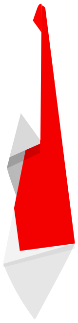
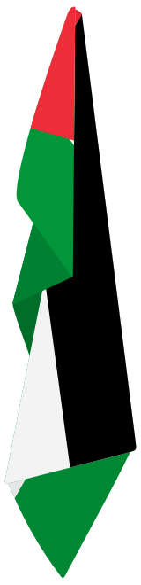

# 🇺🇳 Flag at Rest – SVG Template

This repository provides a simple, reusable SVG template for depicting a **flag at rest**—i.e., when a flag hangs limp on a pole with no wind blowing. You can easily replace the embedded image with your own rectangular flag to generate a realistic hanging flag effect.


## 🧩 How to Use

1. Open the `flag-at-rest-template.svg` file in a code editor.
2. Replace the `href` value inside the `<image>` tag with the URL of your own flag image (must be rectangular, preferably 3:2 or 5:3 ratio).

```html
<image id="_FlagImage" href="path-to-flag-image" ...
```

## Example
<p>
  
  
  
</p>

## Authors

* **Muhammad Azzuhair** - [@msazzuhair](https://github.com/msazzuhair)

## License

This project is open-sourced software licensed under the [MIT License](LICENSE).